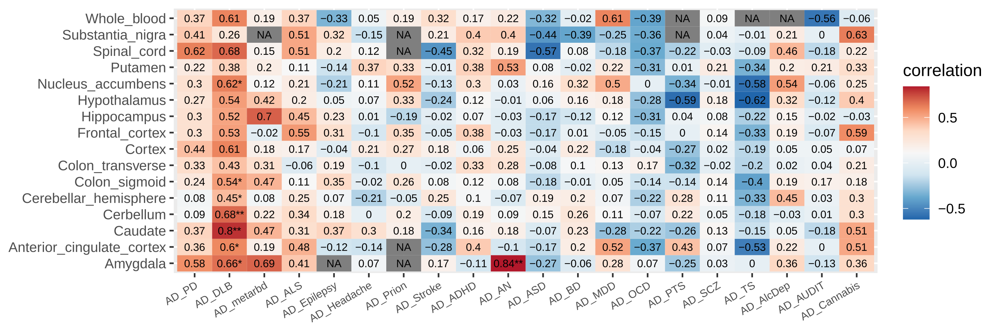
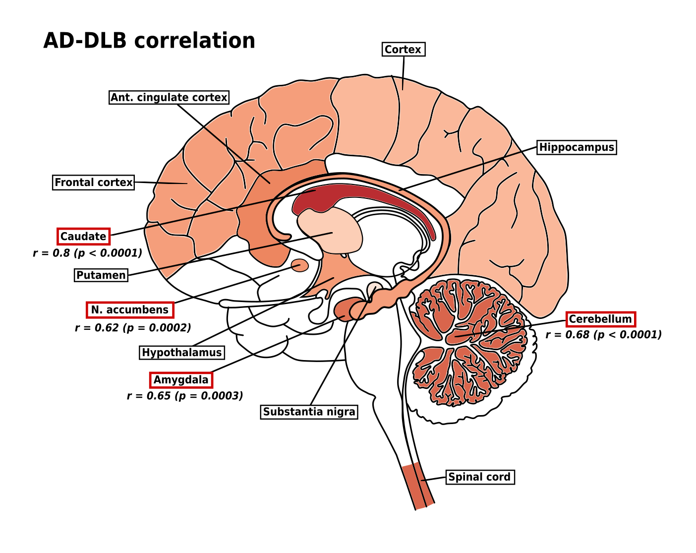

# Genome-wide genetic correlation between traits

In order to identify significant associations between complex traits and gene expression we applied TWAS/FUSION (transcriptome-wide association study) software (Gusev et al. 2016). TWAS was performed for 20 neurological and psychiatric disorders across 16 tissues. Precomputed expression reference weights based on GTEx v7 multi-tissue RNA-seq data for 16 tissues were obtained from http://gusevlab.org/projects/fusion/. Correlation between each pair of disorders was calculated using the RHOGE package (Gusev et al. 2016; Mancuso et al. 2017) (https://github.com/bogdanlab/RHOGE).

## Requirements
For both tools R (version > 3.6) is needed. Installation procedure and requirements for TWAS/FUSION can be found here: http://gusevlab.org/projects/fusion/ ; for RHOGE here: https://github.com/bogdanlab/RHOGE. 

For correct work of all scripts required libraries should be installed in R:
```console
install.packages(c('optparse','RColorBrewer', 'data.table', 'dplyr', 'reshape', 'ggplot2', 'MASS', 'stringr', 'stats', 'tidyr')
```

The whole pipeline is illustrated below. All bash and R scripts are shown in yellow sircles. Dashed line means that this script is launched automatically. Examples of usage for each script are in text below.


## 1. TWAS/FUSION
In the first part of analysis we applied TWAS/FUSION software to 21 phenotypes across 16 tissues. Only genes with a heritability p-value of <0.01 were used as reference data. *make_twas_pheno.sh* launches the next script *make_twas_chr.sh*, which in turn launches *FUSION.assoc_test.R* (the last one was obtained from http://gusevlab.org/projects/fusion/ and can be found there) for each chromosome. As a result we obtained TWAS results for 21 phenotypes across 16 tissues. Note that this part takes ~3 hours for each tissue, ~25% CPU and 4GB of memory. Consider launching it on a server.

**Example of usage:**
```console
./make_pheno.sh /WEIGHTS/Colon_Transverse.pos matched_rs_for_fusion /output_twas
```
**Args:**
1-path to weights (tissue RNA-seq)
2-path to GWAS sumstats
3-output directory

## 2. Merge TWAS results
This step is only needed for merging all TWAS results for each phenotype across all tisues. Major histocompatibility complex (MHC) on chromosome 6 was excluded due to its confused LD structure. 

**Example of usage:**
```console
./merge_twas.sh /output_twas/
```
**Args:**
1-path to TWAS results

## 3. RHOGE
We next estimated correlation between each pair of disorders using RHOGE package in R. For this step it is useful to create a small data frame withh all disorders in analysis and their sample sizes (see disorders.tsv for example). As a result we obtained data frames with correlation coefficients and their p-values and plots (see AD_DLB_cor.tsv and AD_DLB.png for example). This set of scripts works for 1 phenotype. For example, we estimate a correlation between selected phenotype (Alzheimer disease, AD in the example below) and other 20 phenotypes. Correlation was considered significant when FDR-corrected or Bonferroni-corrected p-value was less than 0.05.


**Example of usage:**
```console
./make_rhoge.sh disorders.tsv /output_twas "mod_AD_matchedrs" "AD" 455258 /rhoge_output
```
**Args:**
1-disorders.tsv
2-path to TWAS results
3-full name of a chosen phenotype (how the file of sumstats of this phenotype is named)
4-short name of a chosen phenotype
5-sample size of GWAS for this phenotype
6-output directory

## 4. Heatmap
In order to merge all results in one plot, we created heatmaps for each of neurological disorders. On this heatmap * means that FDR-corrected p-value of estimated correlation is less than 0.005, while ** means that Bonferroni-corrected p-value of estimated correlation is less than 0.05.



**Example of usage:**
```console
Rscript heatmap_FDR.R /rhoge_output/AD
```
**Args:**
1-path to RHOGE results for AD (Alzheimer disease)

## Brain graph

For those who are bored with heatmaps we created brain graph: a schematic illustration of a human brain where different structures are colored according to the correlation coefficient of two disorders. The example is made for AD and DLB:




